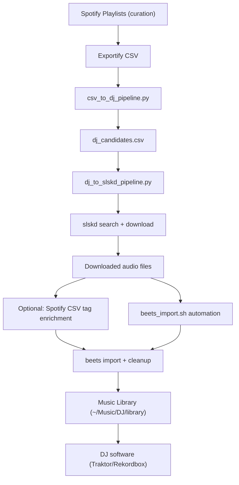

# Workflow Diagram

```mermaid
flowchart TD
  A["Spotify Playlists (curation)"] --> B["Exportify CSV"]
  B --> C["csv_to_dj_pipeline.py"]
  C --> D["dj_candidates.csv"]
  D --> E["dj_to_slskd_pipeline.py"]
  E --> F["slskd search + download"]
  F --> G["Downloaded audio files"]
  G --> H["Optional: Spotify CSV tag enrichment"]
  H --> I["beets import + cleanup"]
  I --> J["Music Library (~/Music/DJ/library)"]
  J --> K["DJ software (Traktor/Rekordbox)"]

  G --> L["beets_import.sh automation"]
  L --> I
```
