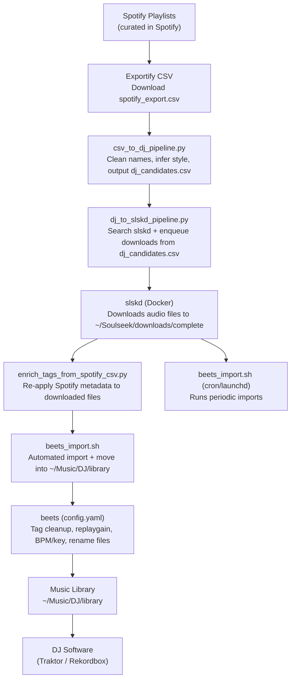

# Workflow Diagram

```mermaid
flowchart TD
  A["Spotify Playlists<br/>(curated in Spotify)"] --> B["Exportify CSV<br/>Download spotify_export.csv"]
  B --> C["csv_to_dj_pipeline.py<br/>Clean names, infer style, output dj_candidates.csv"]
  C --> D["dj_to_slskd_pipeline.py<br/>Search slskd + enqueue downloads from dj_candidates.csv"]
  D --> E["slskd (Docker)<br/>Downloads audio files to ~/Soulseek/downloads/complete"]
  E --> F["enrich_tags_from_spotify_csv.py<br/>Re-apply Spotify metadata to downloaded files"]
  F --> G["beets_import.sh<br/>Automated import + move into ~/Music/DJ/library"]
  G --> H["beets (config.yaml)<br/>Tag cleanup, replaygain, BPM/key, rename files"]
  H --> I["Music Library<br/>~/Music/DJ/library"]
  I --> J["DJ Software<br/>(Traktor / Rekordbox)"]

  %% Optional / automation
  E --> K["beets_import.sh (cron/launchd)<br/>Runs periodic imports"]
```
