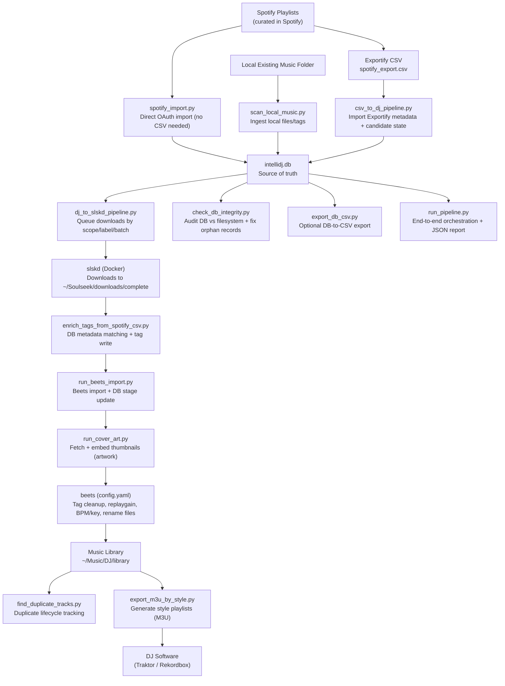

# Workflow Diagram

```mermaid
flowchart TD
  A["Spotify Playlists<br/>(curated in Spotify)"] --> B["Exportify CSV<br/>spotify_export.csv"]
  A --> SA["spotify_import.py<br/>Direct OAuth import (no CSV needed)"]
  X["Local Existing Music Folder"] --> Y["scan_local_music.py<br/>Ingest local files/tags"]
  B --> C["csv_to_dj_pipeline.py<br/>Import Exportify metadata + candidate state"]
  SA --> Z["intellidj.db<br/>Source of truth"]
  Y --> Z
  C --> Z
  Z --> D["dj_to_slskd_pipeline.py<br/>Queue downloads by scope/label/batch"]
  Z --> INT["check_db_integrity.py<br/>Audit DB vs filesystem + fix orphan records"]
  D --> E["slskd (Docker)<br/>Downloads to ~/Soulseek/downloads/complete"]
  E --> F["enrich_tags_from_spotify_csv.py<br/>DB metadata matching + tag write"]
  F --> G["run_beets_import.py<br/>Beets import + DB stage update"]
  G --> H["run_cover_art.py<br/>Fetch + embed thumbnails (artwork)"]
  H --> I["beets (config.yaml)<br/>Tag cleanup, replaygain, BPM/key, rename files"]
  I --> J["Music Library<br/>~/Music/DJ/library"]
  J --> K["find_duplicate_tracks.py<br/>Duplicate lifecycle tracking"]
  J --> L["export_m3u_by_style.py<br/>Generate style playlists (M3U)"]
  L --> M["DJ Software<br/>(Traktor / Rekordbox)"]
  Z --> O["export_db_csv.py<br/>Optional DB-to-CSV export"]
  Z --> N["run_pipeline.py<br/>End-to-end orchestration + JSON report"]
```
